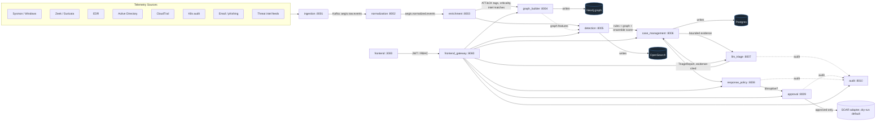

# AegisSOC

**An AI-assisted SOC triage platform.** AegisSOC ingests high-volume
security telemetry, correlates events into a temporal entity graph,
scores attack likelihood with deterministic rules and graph analytics,
and uses an LLM strictly as an evidence-grounded analyst copilot — never
as the detector — to produce auditable incident summaries, ATT&CK
mappings, and safe, human-approved response recommendations.

## Product vision & core principle

Modern SOCs drown in alert volume where only a tiny fraction represents
real attacks. AegisSOC's job is to turn fragmented logs into readable
**attack stories**: ingest → normalize → enrich → build a temporal graph
→ detect suspicious chains → recommend investigative/response actions →
keep a human in the loop for anything disruptive.

> **Core principle: the LLM is never the primary detector.** Detection
> comes from deterministic Sigma-like rules, correlation, graph feature
> extraction, and a calibrated ML ensemble. The LLM (`llm_triage`) is
> invoked only *after* an alert/case already exists, and only to
> summarize, map ATT&CK techniques, draft reports, and justify
> recommendations — always grounded in a bounded, cited evidence set, and
> never able to set a risk score or execute an action on its own.
>
> See [`docs/adr/0002-llm-not-primary-detector.md`](docs/adr/0002-llm-not-primary-detector.md)
> and [`docs/adr/0004-evidence-grounding.md`](docs/adr/0004-evidence-grounding.md).

## Architecture



Full system diagram, data model (ER diagram), and the alert→triage→
approval sequence diagram live in [`docs/ARCHITECTURE.md`](docs/ARCHITECTURE.md).
Why each major storage/detection/LLM/RL choice was made is recorded in
[`docs/adr/`](docs/adr/).

## Repository layout

```
AegisSOC/
├── docker-compose.yml        # full local stack (see "Local setup" below)
├── Makefile                  # up/down/seed/replay/test/load-test/evaluate
├── services/                 # 11 backend services, one dir each (see port table)
│   └── <service>/{app,*_core}/  # FastAPI app + service-specific core logic
├── frontend/                  # React/Vite analyst dashboard (port 3000)
├── packages/common/           # aegis_common: shared schemas, kafka, db, graphstore, auth, observability
├── infra/
│   ├── k8s/                  # namespace, configmaps, per-service Deployment+Service, hpa.yaml
│   ├── helm/aegis/            # thin Helm wrapper around the same topology
│   ├── prometheus/            # scrape config
│   ├── grafana/                # provisioning + dashboards (kafka lag, latency, detection rates)
│   └── otel/                  # OpenTelemetry Collector config (optional profile)
├── docs/
│   ├── ARCHITECTURE.md, EVALUATION.md, SECURITY.md, SCALABILITY.md
│   ├── adr/                  # architecture decision records
│   ├── threat-model/          # STRIDE threat model
│   └── openapi/gateway.yaml   # public API contract
├── data/
│   ├── samples/               # synthetic benign background telemetry
│   ├── scenarios/              # 3 canonical demo scenarios (ground-truth labeled)
│   ├── sigma/                  # Sigma-like detection rules
│   └── intel/, mitre/, assets/ # seeded threat-intel / ATT&CK / asset-criticality data
├── scripts/                    # generate_samples, seed_demo, replay_scenario, evaluate_*, load_test_ingest
└── tests/{unit,integration,load}/
```

## Local setup

Requires Docker + Docker Compose v2 (`docker compose`, not `docker-compose`).

```bash
cp .env.example .env        # fill in OPENAI_API_KEY etc. if you want live LLM calls
make up                     # docker compose up -d --build
make ps                     # check container health
```

`make up` builds and starts every service in
[`docker-compose.yml`](docker-compose.yml): Redpanda (Kafka API),
Neo4j, Postgres, Redis, OpenSearch, all 11 backend services, the
frontend, and Prometheus. Grafana and the OpenTelemetry Collector are
behind the `observability` profile (`make up-observability`) to keep the
default footprint smaller.

`AEGIS_SYNC_MODE` (in `.env`, default `async`) controls whether
data-path services talk over Kafka/Redpanda topics (`async`,
production-shaped) or direct synchronous HTTP calls (`sync`, useful for
tests/CI without a broker) — see
[`docs/ARCHITECTURE.md`](docs/ARCHITECTURE.md#system-diagram).

Tear down with `make down` (keeps volumes/data) or `make nuke` (also
deletes volumes, full reset).

## Demo scenario walkthrough

Three ground-truth-labeled scenarios ship in `data/scenarios/`, designed
to exercise the full pipeline plus its false-positive and
graph-memory behaviors:

1. **`phishing_ransomware_chain.json`** (critical, `is_attack=true`) — a
   spoofed invoice email → macro-enabled Word doc → obfuscated
   PowerShell stager → LSASS credential dumping → lateral movement via
   PsExec/WMI → ransomware deployment on file/SQL servers. The full
   kill chain: initial access → execution → credential access → lateral
   movement → impact.
2. **`benign_admin_false_positive.json`** (low, `is_attack=false`) — a
   routine, change-managed patch-compliance scheduled task that
   superficially matches "suspicious encoded PowerShell" /
   "Office spawns shell"-style rules, but every supporting signal
   (Microsoft-signed binaries, Task Scheduler parent, known service
   account, internal SCCM destination) is benign. Demonstrates that the
   ensemble/graph/LLM layer should down-weight and *explain* this as a
   false positive rather than escalate it.
3. **`repeat_attacker_infra.json`** (high, `is_attack=true`) — the same
   C2 domain/infrastructure fingerprint (seen and contained 46 days
   earlier in a prior incident) reappears against a completely
   different, unrelated user/host. A stateless rule-only detector sees
   two unrelated low/medium alerts; a system with graph/entity memory
   should link both waves via the shared `Domain`/`IP` nodes and escalate
   wave 2 with materially higher confidence, citing the historical case —
   this is the concrete payoff of ADR 0001's graph store.

Run them:

```bash
make up
make seed          # loads threat intel + replays all 3 scenarios in a sensible demo order
# ...or replay one scenario individually, with realistic event pacing:
python scripts/replay_scenario.py data/scenarios/phishing_ransomware_chain.json --speed 200
```

Then open the dashboard at **http://localhost:3000** (demo credentials:
`analyst`/`analyst123`, `senior`/`senior123`, or `admin`/`admin123` — see
[`docs/SECURITY.md`](docs/SECURITY.md#rbac)) to walk the alert queue →
investigation workspace → graph view → triage report → response
recommendation → approval flow end to end.

## Service port table

| Service | Port | Role |
|---|---|---|
| `ingestion` | 8001 | Raw telemetry intake, DLQ, replay API |
| `normalization` | 8002 | Canonical event schema mapping |
| `enrichment` | 8003 | ATT&CK tagging, asset criticality, threat-intel matching |
| `graph_builder` | 8004 | Temporal entity graph writes (Neo4j) |
| `detection` | 8005 | Rules + correlation + graph features + ensemble scoring |
| `case_management` | 8006 | Cases, clustering, timelines, analyst feedback |
| `llm_triage` | 8007 | Evidence-grounded triage reports (never the detector) |
| `response_policy` | 8008 | Playbook/action recommendation |
| `approval` | 8009 | Human-in-the-loop approval gate |
| `audit` | 8010 | Append-only audit trail |
| `frontend_gateway` | 8080 | Public API, JWT auth, RBAC, proxy |
| `frontend` | 3000 | React analyst dashboard |
| Neo4j | 7474 / 7687 | Browser UI / Bolt protocol |
| Postgres | 5432 | Cases, users, approvals, audit |
| Redis | 6379 | Cache / IOC cache |
| OpenSearch | 9200 | Search/investigation index |
| Redpanda (Kafka API) | 9092 | Event streaming backbone |
| Prometheus | 9090 | Metrics |
| Grafana (`observability` profile) | 3001 | Dashboards |
| OTel Collector (`observability` profile) | 4317 / 4318 | Traces/metrics ingest |

Full API contract for `frontend_gateway`: [`docs/openapi/gateway.yaml`](docs/openapi/gateway.yaml).

## Evaluation instructions

```bash
pip install -r scripts/requirements.txt
python scripts/evaluate_detection.py --include-samples          # rule precision/recall/F1 + FP rate
python scripts/evaluate_llm_groundedness.py --reports-dir eval/reports/   # citation validity, hallucination rate
make load-test                                                   # ingestion throughput/latency
```

Metric definitions (detection, SOC-workflow, LLM-quality, system) and
the full baseline comparison table (rule-only → rule+graph+LLM) are in
[`docs/EVALUATION.md`](docs/EVALUATION.md).

## Scalability path

Target design load: **100M logs/day, ~100K alerts/day**. The MVP runs
single-instance infrastructure for simplicity, but every layer has a
concrete, documented upgrade path that requires **no application
rewrite** — only deployment/configuration changes:

- **Streaming**: 1-broker Redpanda → 3-5 broker cluster, 24-48
  partitions/topic keyed by tenant+entity, KEDA lag-based autoscaling.
- **Stateless services**: `ingestion`/`normalization`/`detection` already
  ship with HPA (`infra/k8s/hpa.yaml`); scale by adding pods, not by
  hand-tuning.
- **Graph store**: single Neo4j Community → Causal Cluster/AuraDB with
  read replicas — `graph_builder` is already the only writer, so this is
  a connection-string change.
- **Search tiers**: single-node OpenSearch → hot (7-30d)/warm/cold
  (ISM-managed snapshots) tiering.
- **LLM cost decoupling**: `llm_triage` only ever runs per-case
  (~100K/day), never per-log (100M/day) — a ~1000x call-volume reduction
  by construction, further reduced via evidence caching and tiered model
  selection.

Full detail, SLOs, and a before/after summary table:
[`docs/SCALABILITY.md`](docs/SCALABILITY.md). The architectural
rationale for designing this way from day one is
[`docs/adr/0005-mvp-to-production-scale.md`](docs/adr/0005-mvp-to-production-scale.md).

## Known limitations

- **Internship-scale production *shape*, not production *capacity*** —
  every major service/API boundary from the architecture is implemented
  (11 backends + BFF + React UI). Graph ML uses a numpy GraphSAGE-style
  neighborhood scorer rather than a GPU-trained heterogeneous GNN; live
  VirusTotal/OpenCTI connectors are optional stubs behind local intel
  JSON feeds.
- **Prompt-injection defenses are heuristic**, not a hardened classifier
  — pattern-based sanitization plus output/groundedness validation is
  the real backstop (see `docs/threat-model/THREAT_MODEL.md` §2).
- **Tenant isolation is logical, not physical** — `tenant_id`-scoped
  queries are appropriate for internal multi-environment use, not for
  hosting mutually-adversarial tenants (§4 of the threat model).
- **No online RL** — response recommendations use a playbook engine plus
  an offline-evaluated LinUCB contextual bandit
  (`docs/adr/0003-offline-rl-first.md`); PPO/DQN stay simulation-only.
- **Ingestion edge auth** (per-source mTLS/API keys) is required before
  exposing `ingestion` outside a trusted network (`docs/SECURITY.md`).
- **Local docker-compose ≠ 100M logs/day** — single-node Redpanda/Neo4j/
  OpenSearch for demos; scale-out is documented in
  [`docs/SCALABILITY.md`](docs/SCALABILITY.md) and `infra/k8s/hpa.yaml`.

## Quick sync-mode demo (no infra containers)

```bash
# Terminal 1 — gateway runs the full pipeline in-process
make sync-gateway   # http://localhost:8080

# Terminal 2 — analyst UI
cd frontend && npm install && npm run dev   # http://localhost:5173
# Login: analyst / analyst123
# Replay → run phishing_ransomware_chain
```

## Engineering deliverables checklist

- [x] Modular, service-oriented monorepo (`services/*`, `packages/common`, `frontend`)
- [x] Canonical event/graph schema (`packages/common/aegis_common/schema/events.py`)
- [x] `docker-compose.yml` full local stack with healthchecks, networks, volumes, `AEGIS_SYNC_MODE`
- [x] Kubernetes manifests (`infra/k8s/`) + HPA for ingest/normalize/detect
- [x] Helm chart (`infra/helm/aegis/`)
- [x] Prometheus scrape config + Grafana dashboards (kafka lag, latency, detection rates)
- [x] Sample datasets, seeded demo scenarios, and replay tooling (`data/`, `scripts/`)
- [x] OpenAPI contract for the public gateway API (`docs/openapi/gateway.yaml`)
- [x] Architecture decision records (`docs/adr/0001`–`0005`)
- [x] STRIDE threat model (`docs/threat-model/THREAT_MODEL.md`)
- [x] Architecture, evaluation, security, and scalability docs (`docs/*.md`)
- [x] Unit tests (`packages/common/tests`) and a load-test harness (`scripts/load_test_ingest.py`, `tests/load/locustfile.py`)
- [x] Evidence-grounded LLM triage with output validation (`services/llm_triage`)
- [x] Human-in-the-loop approval workflow gating all disruptive actions (`services/approval`)
- [x] Full audit trail for every AI recommendation and human decision (`services/audit`)

## Contributing / license

MIT licensed — see [`LICENSE`](LICENSE). See [`prompt.md`](prompt.md) for
the original project brief this repository implements.
