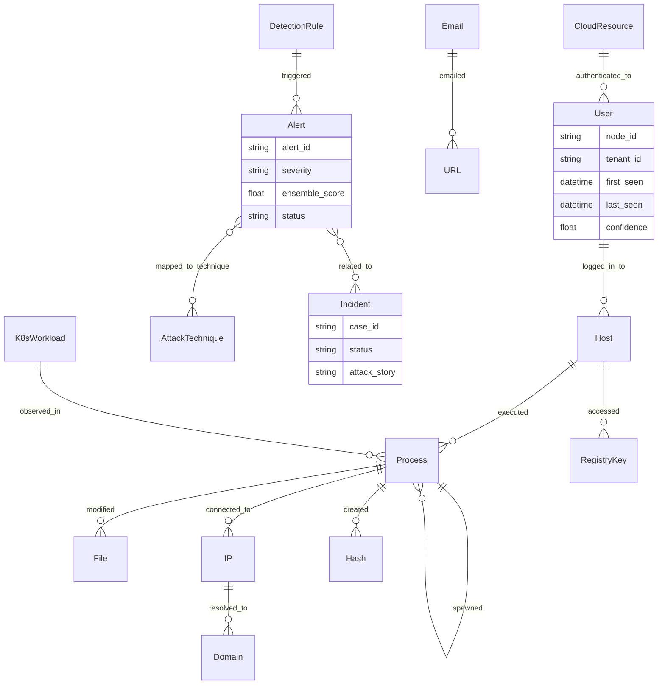
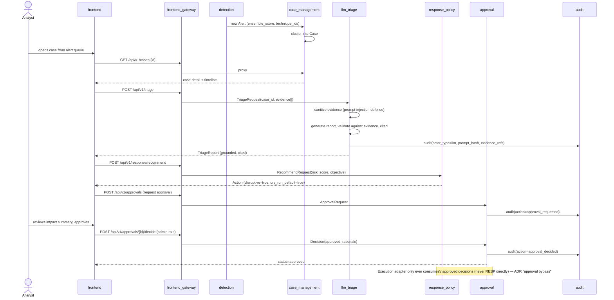

# AegisSOC Architecture

## Core principle
**The LLM is never the primary detector.** Detection is deterministic and
statistical (rules, correlation, graph features, calibrated ML ensemble).
The LLM (`llm_triage`) is an evidence-grounded analyst copilot invoked
*after* detection already produced an alert/case — see
`docs/adr/0002-llm-not-primary-detector.md` and
`docs/adr/0004-evidence-grounding.md`.

## System diagram

```mermaid
flowchart LR
    subgraph Sources["Telemetry Sources"]
        S1[Sysmon / Windows]
        S2[Zeek / Suricata]
        S3[EDR]
        S4[Active Directory]
        S5[CloudTrail]
        S6[K8s audit]
        S7[Email / phishing]
        S8[Threat intel feeds]
    end

    subgraph Streaming["Streaming (Kafka / Redpanda)"]
        T1[(aegis.raw.events)]
        DLQ[(aegis.raw.dlq)]
        T2[(aegis.normalized.events)]
        T3[(aegis.enriched.events)]
        T4[(aegis.graph.updates)]
        T5[(aegis.alerts)]
        T6[(aegis.cases)]
        T7[(aegis.actions)]
        T8[(aegis.audit)]
    end

    Sources --> ING[ingestion :8001]
    ING --> T1
    ING -.malformed.-> DLQ
    T1 --> NORM[normalization :8002]
    NORM --> T2
    T2 --> ENR[enrichment :8003]
    ENR -->|ATT&CK tags, asset criticality,\nthreat-intel matches| T3
    T3 --> GB[graph_builder :8004]
    GB -->|writes| NEO4J[(Neo4j graph store)]
    GB --> T4
    T3 --> DET[detection :8005]
    T4 --> DET
    DET -->|rules + correlation + graph\nfeatures + ensemble score| T5
    DET -->|writes| OS[(OpenSearch)]
    T5 --> CASE[case_management :8006]
    CASE -->|writes| PG[(Postgres)]
    CASE --> T6

    CASE -->|evidence request| LLM[llm_triage :8007]
    NEO4J -.evidence.-> LLM
    OS -.evidence.-> LLM
    LLM -->|TriageReport, evidence-cited| CASE

    CASE -->|risk + objective| RESP[response_policy :8008]
    RESP -->|disruptive action?| APPR[approval :8009]
    APPR -->|approved| EXEC[(SOAR adapter, dry-run default)]
    RESP -. non-disruptive .-> EXEC

    LLM -. audit .-> AUDIT[audit :8010]
    APPR -. audit .-> AUDIT
    RESP -. audit .-> AUDIT
    AUDIT -->|writes| PG

    GW[frontend_gateway :8080] --> CASE
    GW --> DET
    GW --> GB
    GW --> LLM
    GW --> RESP
    GW --> APPR
    GW --> AUDIT
    UI[frontend :3000] -->|JWT / RBAC| GW

    classDef store fill:#1b2733,stroke:#4fa3ff,color:#e6edf3;
    class NEO4J,OS,PG store;
```

**Async vs sync path**: every data-path service reads `AEGIS_SYNC_MODE`
(`async` by default). In `async` mode, services communicate exclusively
via the Kafka topics above (production-shaped). In `sync` mode, the same
services expose direct HTTP endpoints (`/api/v1/normalize`, `/api/v1/enrich`,
`/api/v1/graph/ingest`, `/api/v1/detect`) so local dev, unit tests, and CI can run
the whole pipeline without a broker. The service boundaries and payload
schemas are identical in both modes — only the transport differs.

## Service boundaries

| Service | Port | Responsibility | Talks to |
|---|---|---|---|
| `ingestion` | 8001 | Accept raw telemetry, publish to Kafka, DLQ malformed records, replay scenarios | Kafka |
| `normalization` | 8002 | Map source-native records to `CanonicalEvent`, timestamp/UTC normalization, source confidence | Kafka |
| `enrichment` | 8003 | ATT&CK tagging, asset criticality, identity resolution, threat-intel matches | Kafka, Redis (intel cache) |
| `graph_builder` | 8004 | Entity resolution + typed edge upserts into the temporal graph | Kafka, Neo4j |
| `detection` | 8005 | Rules, correlation, graph features, calibrated ensemble scoring, alert creation | Kafka, Neo4j (read), OpenSearch |
| `case_management` | 8006 | Case CRUD, alert clustering/dedup, timelines, analyst feedback | Postgres, Kafka |
| `llm_triage` | 8007 | Evidence-grounded summarization, ATT&CK mapping, investigation queries, groundedness validation | case_management, graph_builder (evidence), LLM API |
| `response_policy` | 8008 | Playbook/action recommendation, disruptive-action flagging | case_management |
| `approval` | 8009 | Human-in-the-loop approval gate for disruptive actions | Postgres, audit |
| `audit` | 8010 | Append-only log of every AI recommendation, evidence, and human decision | Postgres |
| `frontend_gateway` | 8080 | Public API, JWT auth, RBAC, proxy to internal services | all of the above |
| `frontend` | 3000 | React analyst dashboard | frontend_gateway |

## Data model

Every node and edge (`GraphNode`/`GraphEdge` in
`packages/common/aegis_common/schema/events.py`) carries `sources`,
`first_seen`/`last_seen`, `count`, `confidence`, `tenant_id`, and
`provenance_ids` pointing back to raw events — this is what makes
detections and LLM citations traceable to source data (ADR 0004).

## Sequence: alert to analyst-approved action

## Storage responsibilities
See `docs/adr/0001-graph-plus-search-storage.md` for the full rationale.

- **Neo4j** — canonical entity graph, attack-path traversal, incident memory.
- **OpenSearch** — full-text search/investigation, alert queue, dashboards.
- **Postgres** — cases, users, approvals, audit (transactional/relational).
- **Redis** — cache/session acceleration, threat-intel IOC cache.
- **Kafka/Redpanda** — the event backbone connecting every data-path stage.

## Related documents
- `docs/adr/` — why these choices were made.
- `docs/threat-model/THREAT_MODEL.md` — STRIDE analysis of the boundaries above.
- `docs/SECURITY.md` — controls reference (RBAC, secrets, encryption, PII, prompt injection).
- `docs/SCALABILITY.md` — how each layer scales past the MVP topology.
- `docs/EVALUATION.md` — how detection/LLM/system quality is measured.
- `docs/openapi/gateway.yaml` — the public API contract.
